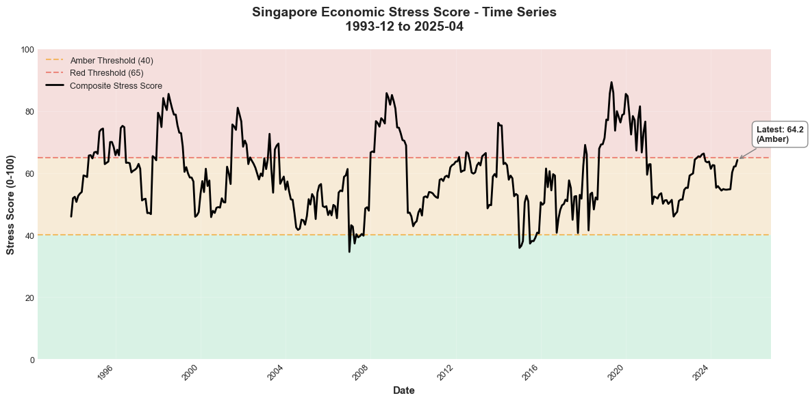
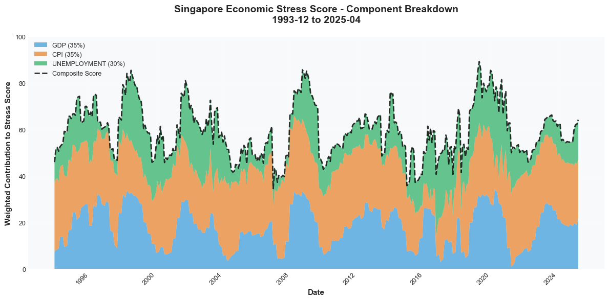
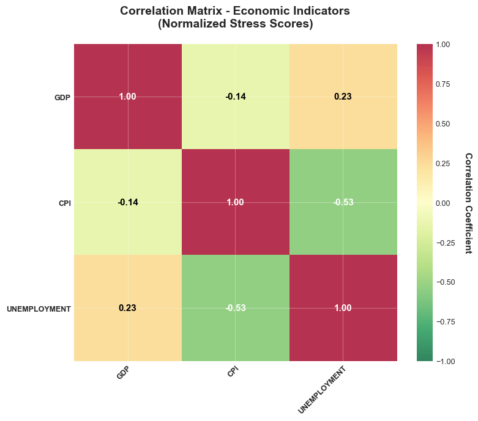
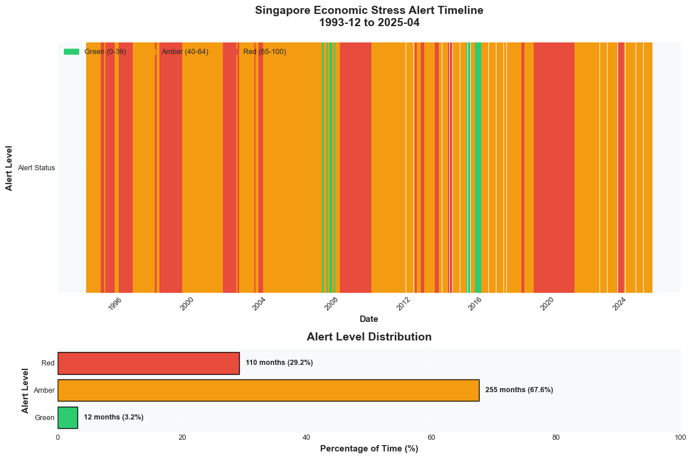

# Singapore Economic Stress Monitor


A Python-based economic stress monitoring system that transforms Singapore's macroeconomic indicators into actionable early-warning signals for risk management and economic analysis.

## Overview

This dashboard combines **3 economic indicators** (GDP, CPI, Unemployment) into a single **0-100 stress score** with Green/Amber/Red alert classification. It provides:

- ✅ **Automated data processing** from SingStat API
- ✅ **Statistical normalization** (36-month rolling z-scores)
- ✅ **Weighted composite scoring** (GDP 35%, CPI 35%, Unemployment 30%)
- ✅ **4 visualization charts** (timeseries, components, correlations, alerts)
- ✅ **Alert classification** (Green: 0-39, Amber: 40-64, Red: 65-100)

## Use Cases

This economic stress monitor is valuable for:
1. **Financial institutions** monitoring macroeconomic risk exposure
2. **Investment firms** tracking economic regime changes
3. **Risk managers** requiring early-warning indicators
4. **Policy analysts** studying economic stress patterns
5. **Researchers** analyzing Singapore's economic history

The dashboard consolidates multiple risk signals into a single metric for systematic decision-making.

## Quick Start

### 1. Installation

```bash
# Clone or download this repository
cd singapore-economic-stress-monitor

# Install dependencies
pip install -r requirements.txt
```

### 2. Fetch Latest Data

```bash
# Download latest data from SingStat API
python fetch_singstat_api.py

# Transform to clean CSV format
python transform_data.py
```

### 3. Run Dashboard

```bash
# Full pipeline with charts
python main.py

# Quick status check (no charts)
python main.py --quiet --no-charts
```

### 4. Export Frontend Payloads

```bash
# Generate latest.json/history.json/indicators.json for frontend and API
python export_frontend_data.py --quiet
```

### 5. View Results

Charts are saved to `output/` directory, and frontend payloads to:
- `frontend/public/projects/singapore-economic-stress-monitor/data/`
- `output/dashboard_data/`

Charts:
- `stress_timeseries.png` - Historical stress score with threshold bands
- `component_breakdown.png` - Weighted contributions by indicator
- `correlation_heatmap.png` - Indicator correlation matrix
- `alert_timeline.png` - Green/Amber/Red periods over time

## Sample Visualizations

### Stress Score Time Series


### Component Breakdown


### Correlation Heatmap


### Alert Timeline


## Project Structure

```
singapore-economic-stress-monitor/
├── data/                      # Economic indicator CSVs
│   ├── gdp_clean.csv          # GDP growth (quarterly → monthly)
│   ├── cpi_clean.csv          # Consumer Price Index (monthly)
│   └── unemployment_clean.csv # Unemployment rate (quarterly → monthly)
├── src/                       # Core modules
│   ├── data_loader.py         # Load and align CSV data
│   ├── frontend_data.py       # Build frontend/API JSON payloads
│   ├── normalizer.py          # Z-score normalization
│   ├── stress_scorer.py       # Weighted composite scoring
│   └── visualizer.py          # Chart generation
├── frontend/                  # React/Vite project showcase page
│   └── public/projects/...    # Static JSON payloads for web UI
├── .github/workflows/         # Automated data refresh workflow
├── api_server.py              # FastAPI read-only backend endpoints
├── output/                    # Generated charts
├── fetch_singstat_api.py      # Data fetcher from SingStat
├── transform_data.py          # Data transformation script
├── export_frontend_data.py    # Export backend results to frontend JSON
├── main.py                    # Main orchestration script
├── config.py                  # Configuration (weights, thresholds)
├── README.md                  # This file
├── USAGE.md                   # Detailed usage guide
└── requirements.txt           # Python dependencies
```

## Methodology

### 1. Data Sources (SingStat API)

| Indicator | Frequency | Weight | Economic Impact |
|-----------|-----------|--------|-----------------|
| GDP Growth | Quarterly | 35% | Overall economic health |
| CPI (Inflation) | Monthly | 35% | Purchasing power erosion |
| Unemployment | Quarterly | 30% | Labor market stress |

### 2. Normalization Process

**Step 1**: Calculate 36-month rolling z-score
```
z = (value - rolling_mean) / rolling_std
```

**Step 2**: Directional inversion (GDP only)
- Higher GDP growth = less stress → multiply by -1

**Step 3**: Sigmoid transformation to 0-100 scale
```
score = 100 / (1 + e^(-z))
```

This ensures:
- z = -3 → score ≈ 5 (very low stress)
- z = 0 → score = 50 (neutral)
- z = +3 → score ≈ 95 (very high stress)

### 3. Composite Scoring

```
Composite Score = (0.35 × GDP_score) + (0.35 × CPI_score) + (0.30 × Unemployment_score)
```

### 4. Alert Classification

| Alert Level | Score Range | Interpretation | Action |
|-------------|-------------|----------------|--------|
| 🟢 Green | 0 – 39 | Low stress | Routine monitoring |
| 🟡 Amber | 40 – 64 | Elevated stress | Heightened vigilance |
| 🔴 Red | 65 – 100 | High stress | Activate risk response |

## Key Features

### Statistical Rigor
- **36-month rolling window** adapts to changing economic regimes
- **Z-score normalization** ensures equal contribution regardless of scale
- **Sigmoid transformation** creates smooth, bounded 0-100 scores

### Automated Data Pipeline
- Fetch latest data from SingStat API (no manual downloads)
- Transform wide-format API data to clean CSV
- Handle quarterly → monthly resampling (forward-fill)
- Align all indicators to common date range
- Export frontend/API payloads from backend computations
- Scheduled GitHub Actions refresh and commit updated payloads

## Frontend + API Integration

### Frontend Data Flow
- Frontend tries backend API first when `VITE_API_BASE_URL` is set
- On API failure, frontend falls back to static JSON payloads in `frontend/public/.../data`

### Backend API Endpoints (Read-only)
- `GET /healthz`
- `GET /api/stress-monitor/latest`
- `GET /api/stress-monitor/history`
- `GET /api/stress-monitor/indicators`

Run locally:
```bash
uvicorn api_server:app --host 0.0.0.0 --port 8000
```

Security controls included:
- CORS allowlist via `CORS_ALLOWED_ORIGINS`
- GET-only API surface (read-only)
- Security headers (`nosniff`, `DENY`, referrer policy)
- Project metadata and repository URL supplied via env (`PROJECT_ID`, `PROJECT_NAME`, `PROJECT_REPOSITORY_URL`)

### Professional Visualizations
- Time series with threshold bands
- Stacked area showing component contributions
- Correlation heatmap (3×3 matrix)
- Alert timeline (color-coded stress periods)

## Sample Output (Based on Included Data)

Example results from the included sample dataset:

- **Composite Score**: 64.2 🟡 AMBER (close to Red threshold)
- **Main Driver**: CPI at 71.9 (inflation stress)
- **Recent Trend**: -2.3 points below historical average (improving)
- **Historical Distribution**: 3.2% Green, 67.6% Amber, 29.2% Red

*Note: Run the dashboard with latest data for current economic conditions.*

## Configuration

All parameters are configurable in `config.py`:

```python
# Indicator weights (must sum to 1.0)
INDICATOR_WEIGHTS = {
    'gdp': 0.35,
    'cpi': 0.35,
    'unemployment': 0.30
}

# Alert thresholds
THRESHOLDS = {
    'green': (0, 39),
    'amber': (40, 64),
    'red': (65, 100)
}

# Normalization parameters
ROLLING_WINDOW_MONTHS = 36
SIGMOID_STEEPNESS = 1.0
```

## Known Limitations

1. **Only 3 indicators** (originally planned 6, but Wage/SORA/PMI not API-accessible)
2. **Quarterly data resampled to monthly** using forward-fill (not interpolation)
3. **First 36 months have incomplete z-scores** (window build-up period)
4. **No real-time data** (shows most recent published data only)
5. **Data.gov.sg API schema may change** (fetch script may need maintenance)

## Requirements

- Python 3.8+
- pandas >= 1.3.0
- numpy >= 1.21.0
- matplotlib >= 3.4.0
- requests >= 2.26.0

See `requirements.txt` for exact versions.

## Data Attribution

All economic indicators are sourced from the **Singapore Department of Statistics (SingStat)** via [data.gov.sg](https://data.gov.sg).

**Datasets Used:**
- GDP Year-on-Year Growth Rate (Quarterly)
- Consumer Price Index (2024 Base Year, Monthly)
- Unemployment Rate (Quarterly, Seasonally Adjusted)

**License:** Singapore Open Data Licence v1.0
**Attribution:** Data.gov.sg, Department of Statistics Singapore

This project is for educational and analytical purposes. Economic indicators are subject to revisions and should be validated against official sources.

## Documentation

- **README.md** (this file) - Project overview and methodology
- **USAGE.md** - Detailed setup and usage instructions
- **TECHNICAL_GUIDE.md** - Deep technical documentation for developers

## Support

For questions or issues:
1. Check `USAGE.md` for detailed instructions
2. Review `config.py` for parameter tuning
3. Run tests: `python -m src.data_loader`, `python -m src.normalizer`, etc.

## Version

**v1.0.0** - Initial release (December 2024)

## License

This project is licensed under the MIT License - see the [LICENSE](LICENSE) file for details.

## Author

Developed as part of a portfolio project demonstrating data engineering, statistical analysis, and risk management capabilities.

---

**⚠️ Disclaimer**: This dashboard is for educational and analytical purposes only. Economic indicators are subject to revisions and should be validated against official sources. Alert classifications are statistical indicators, not financial advice or policy recommendations.
